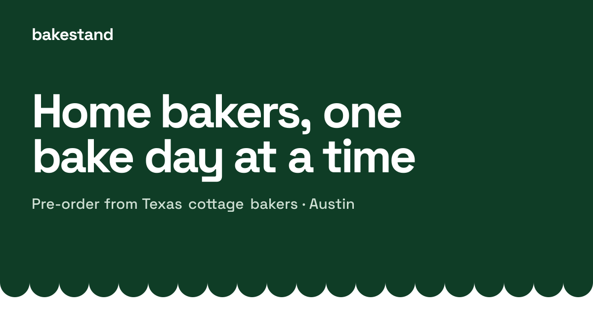

## The motivation

Texas cottage food law lets anyone bake at home and sell straight to their neighbors, and Austin is full of people doing it: sourdough on Saturdays, cookies for the holidays, an honor-system stand on the porch. But almost all of it runs on Instagram posts, DMs, and Venmo. A baker announces a bake day, fields orders one message at a time, keeps a tally of who paid in a notes app, and hopes everyone shows up for pickup.

The tools that do exist are storefront builders made for shops with continuous inventory. That isn't how a home baker works. They bake a fixed batch, on a fixed day, and they're done when it sells out.

## The plan

Bakestand is a marketplace built around that batch model. Every baker gets a _stand_ at `bakestand.co/{their-name}`, and sells through it one bake day at a time:

1. **Plan a bake day.** The baker picks the products, sets fixed quantities, adds pickup or delivery windows, and chooses an order cutoff.
1. **Buyers pre-order.** Buyers browse bake days across Austin, reserve what they want, and pay up front. When a batch sells out or the cutoff passes, the bake day closes.
1. **Bake, hand off, get paid.** The baker works an order board on bake day and marks orders fulfilled. The money is paid out 48 hours after the order is complete, so refunds and problem reports can still be settled from it.

The platform handles the parts a baker shouldn't have to think about: payments, refunds, disputes, reviews, and cottage food compliance. That last one covers printable labels carrying the exact statement Texas law requires, a food handler card on file before a stand opens, and tracking the year's sales against the annual cap.

The scope is deliberately narrow: scheduled bake days only, with no custom orders, no shipping, and one baker per cart. Bakestand takes 8.5% of the food plus 30¢ an order, and tips go to the baker in full.

## The implementation

The app is **Next.js** (App Router) deployed on **Vercel**, with server components rendering the buyer pages for SEO. The styling is **Tailwind** with shadcn/ui underneath a custom "Awning" design: a deep green ink, square corners, and a scalloped awning edge.

The backend is **Supabase**: Postgres 17 with PostGIS for locations, Auth for magic link, Google, and password sign-in, Storage for product photos and food handler cards, and `pg_cron` for anything that runs on a timer.

Business logic is split deliberately between two trusted tiers:

- **Postgres owns anything atomic or money-touching.** Reserving inventory, moving an order or a bake day between states, and fee math are all `SECURITY DEFINER` functions, and the order state machine is enforced by a trigger. Neither a client nor a buggy handler can produce an illegal state. Row-level security handles authorization, anonymous visitors can only read through `public_*` views, and the orders table has column-level grants.
- **Next.js owns anything that calls an outside service.** Stripe, geocoding (the US Census geocoder), email through **Resend**, and PDF label sheets (`pdf-lib`) all live in route handlers and server actions, because a database transaction should never block on an HTTP call. There are no Supabase Edge Functions, which keeps everything in one repo, one runtime, and one deploy target.

Payments run on **Stripe Connect**. Each baker onboards through Stripe's hosted flow, and orders are destination charges, which makes Bakestand the merchant of record. Payouts are manual: every charge, fee, refund, and payout is written to a ledger, and a payout pays ledger rows rather than orders. That way, a refund that lands after a payout simply comes off the next one. Both Stripe webhooks record each event before acting on it, so a retried delivery is never processed twice.

Background work is scheduled by `pg_cron` rather than Vercel Cron: a refund worker every 15 minutes, payouts hourly, and an email outbox every 2 minutes. Each job reaches the deployed app with `pg_net`, authenticating with a secret kept in Supabase Vault.

The site is live at [bakestand.co](https://bakestand.co) behind a coming-soon page while I interview bakers against the seller tools. Test stands share the production database with real ones but are visible only to admins and their own baker, so the full flow can be tried in production without anyone else seeing it.
