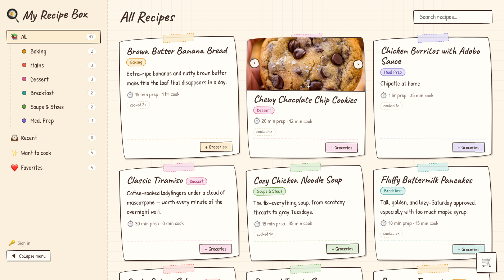

## The motivation

The recipes I actually cook were scattered everywhere: bookmarked blog posts buried under ads and life stories, screenshots in my camera roll, a notes app, and a few family recipes on index cards. Planning a week of dinners meant opening each one and adding up the ingredients by hand to build a grocery list.

I wanted one place for all of them that felt more like a physical recipe box than a database.

## The plan

My Recipe Box is a personal recipe manager with a handwritten, colorful look: taped-down index cards, the Caveat and Patrick Hand fonts, and a color for every category. It covers:

1. **Browsing.** A sidebar groups recipes by category, alongside views for Favorites, Want to Cook, and Recently Cooked. A search box matches titles, descriptions, and ingredients.
1. **Cooking.** Each recipe page has its ingredients and steps, photos (including one per step), personal notes, and an "I cooked this today!" log.
1. **Shopping.** Any recipe can be added to the grocery list, which combines ingredients across every selected recipe (2 cups of flour plus 1 cup of flour is 3 cups), with check-offs that persist.

Recipes are public to read, so any one of them is a link I can send to a friend. Only I can add or edit them.

## The implementation

The frontend is a **React 19 + TypeScript** single-page app built with **Vite**. It uses plain CSS with design tokens and no router library: a small route table maps URLs to views, and navigation uses `pushState`.

The backend is **Neon** for everything: serverless Postgres for the data, Neon Auth for Google sign-in, and a private object storage bucket (S3-compatible) for photos.

The API is a small, framework-free handler over Postgres that runs in two places. In production it's a **Vercel** serverless function that `vercel.json` routes every `/api/*` request to. In development the same handler is mounted into the Vite dev server as middleware, so `npm run dev` talks to the real database with no separate server to run.

A few details:

- **Owner-only writes.** Every non-GET request needs a Neon Auth token, verified with `jose` against Neon's public keys, whose email matches the owner's.
- **Photos.** The browser downscales a photo before uploading it. Displaying one goes through `/api/photos/<file>`, which redirects to a short-lived presigned URL, so the bucket itself stays private.
- **Link previews.** Crawlers don't run JavaScript, so recipe URLs are routed to the API function, which serves the app's HTML with that recipe's title, description, and cover photo filled into the preview tags.
- **Tests.** Vitest and React Testing Library run against a `localStorage` stand-in for the API, so the test suite never needs a database.

It's hosted on Vercel and live at [recipes.alexoser.com](https://recipes.alexoser.com).
